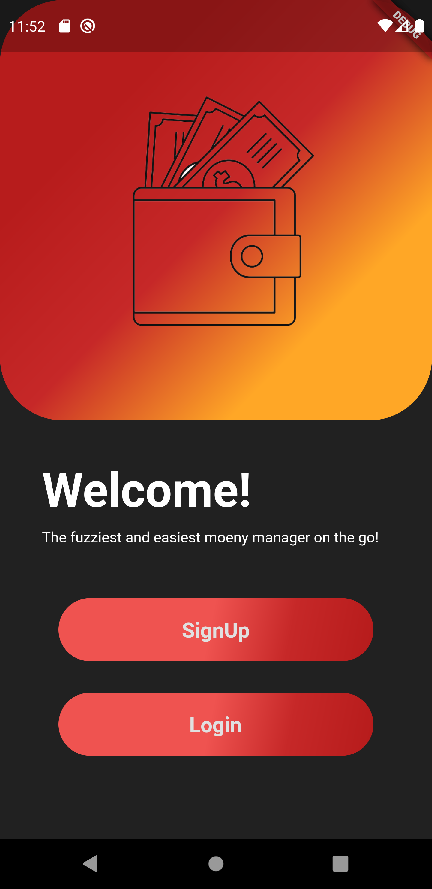
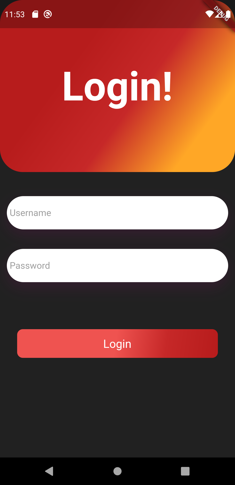
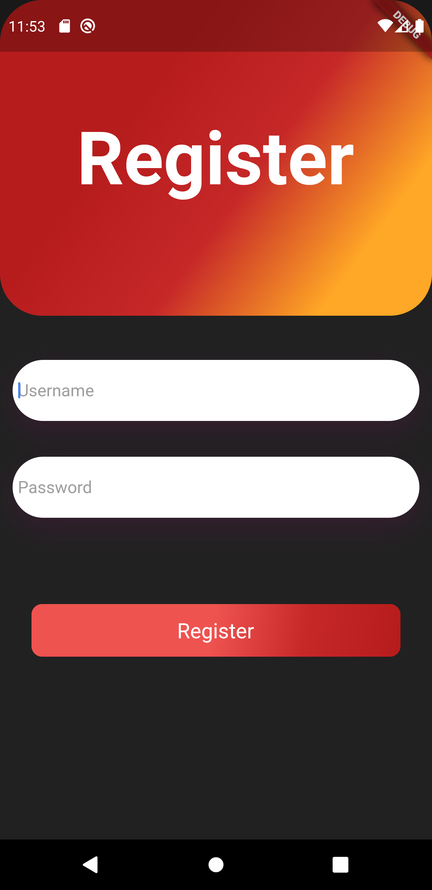
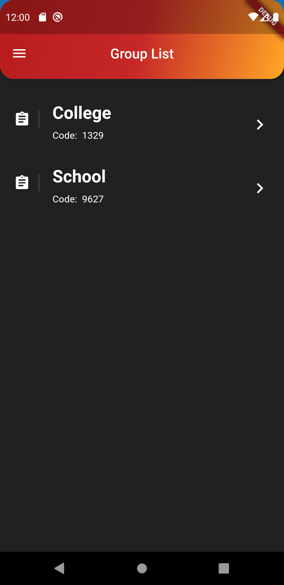
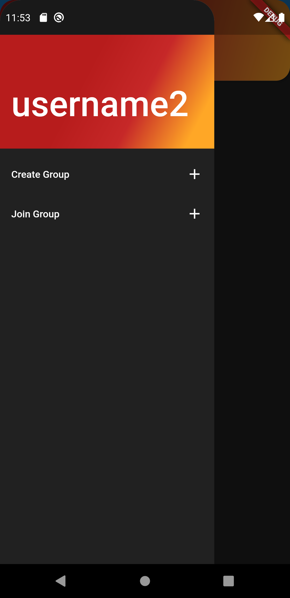
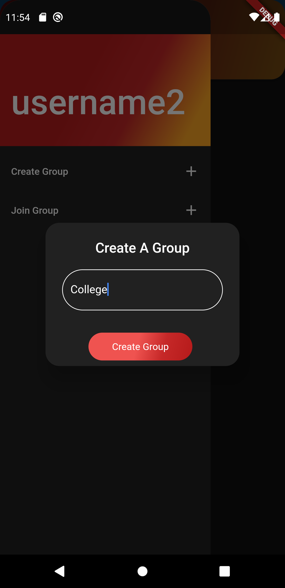
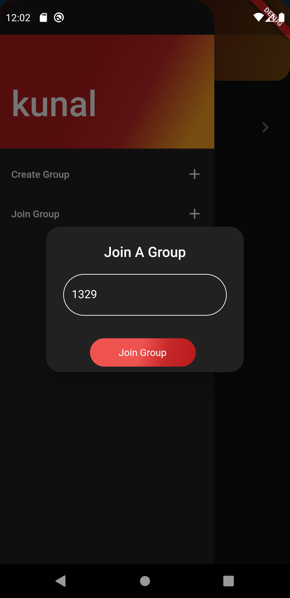
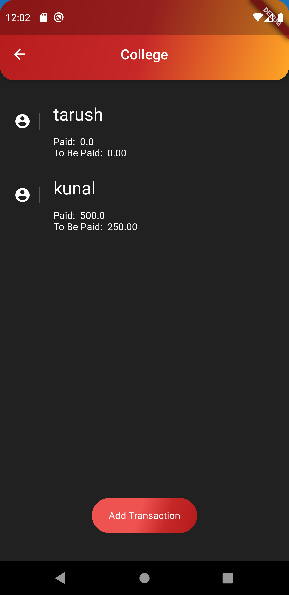
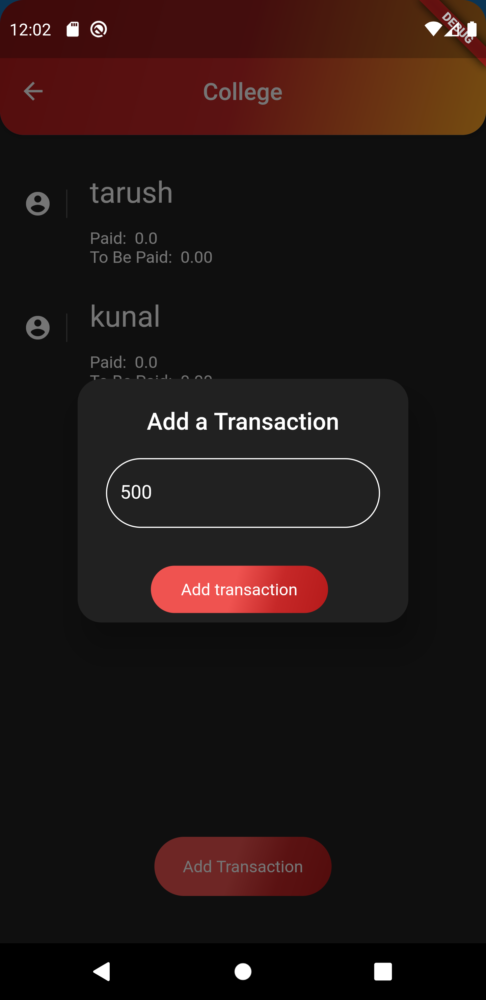

# Money-Manager
This app helps the users by creating groups of friends and managing their expenses during trips and events. This app demonstrates the use of flask api on the backend with flutter UI on the frontend

                           

